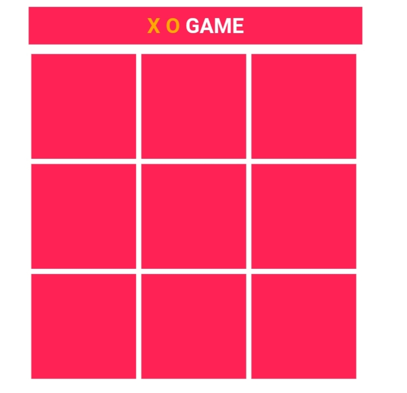
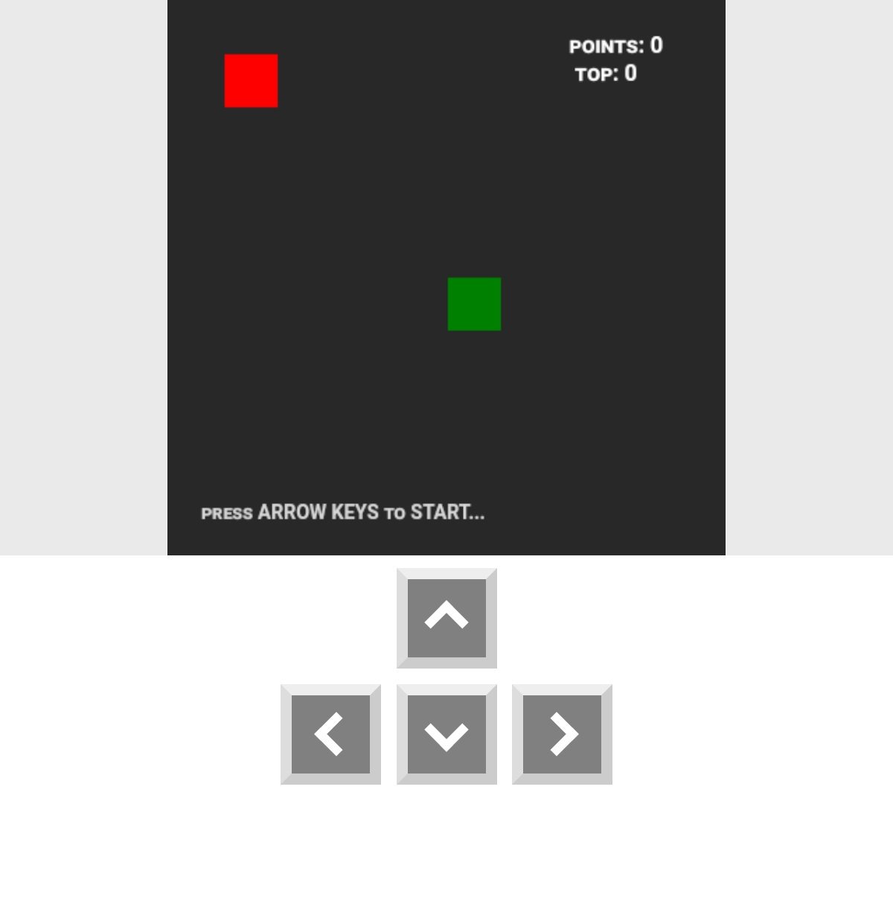
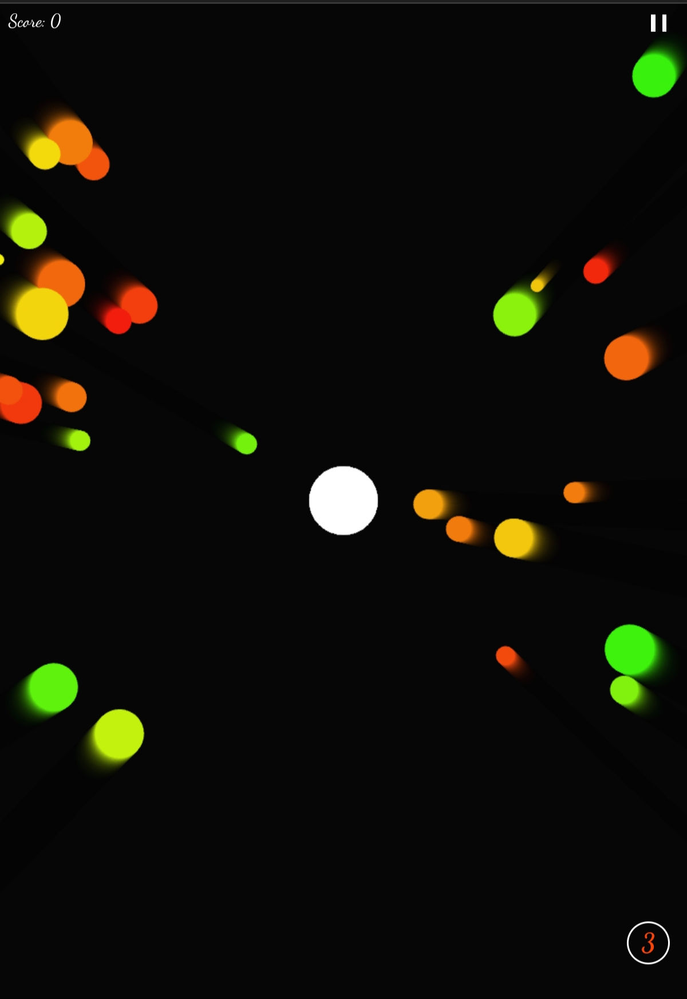
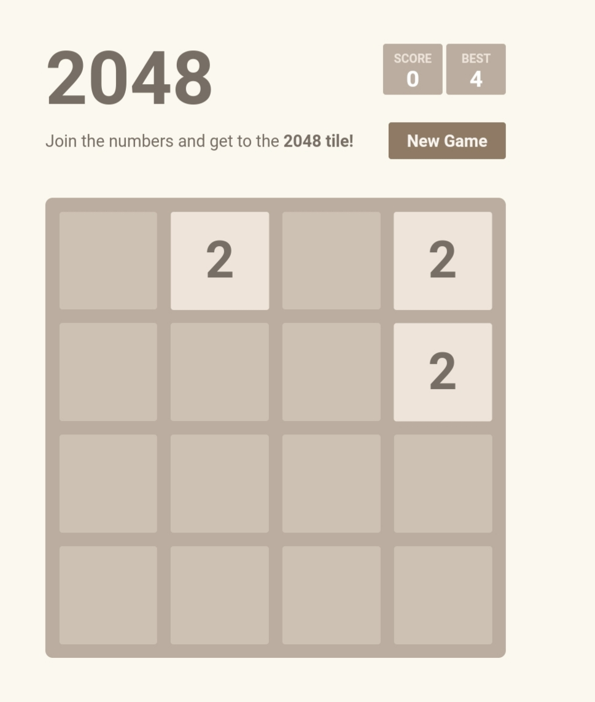
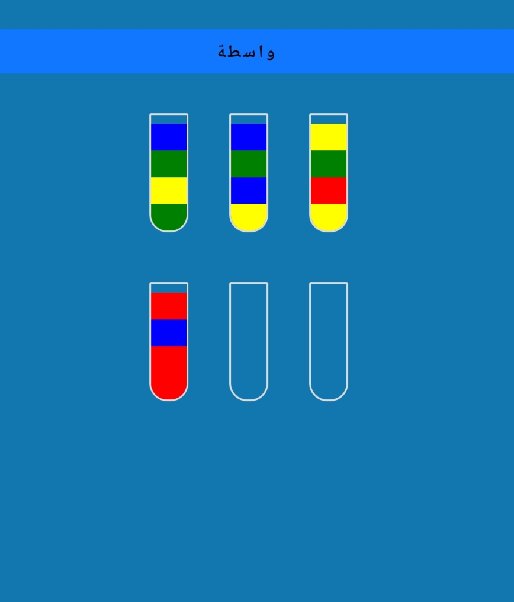

<!DOCTYPE html>
<html lang="en">

<head>
  <meta charset="UTF-8">
  <meta http-equiv="X-UA-Compatible" content="IE=edge">
  <meta name="viewport" content="width=device-width, initial-scale=1.0">
  <title>ECommerce-ShoppingCart | Korsat X Parmaga</title>
<link rel="stylesheet" href="https://cdnjs.cloudflare.com/ajax/libs/font-awesome/6.4.0/css/all.min.css"> 

    
    <!-- styles  -->
    <link rel="stylesheet" href="assets/css/style.css">
</head>

<body>
    <!-- HEADER  -->
    <header>
        <!-- NAV  -->
        

            <a href="#" class="logo">Abdulla</a>
<a href="Play games online by Abdulla2.html" ><i class="fas fa-sun"></i></a>
            <!-- CART ICON  -->
            
        

    </header>

    <!-- SHOP SECTION  -->
    <section class="shop container">
        <h2 class="section-title">play games online </h2>

        <!-- CONTENT  -->
        

            <!-- BOX 1 -->
            

                         
                         
                <h2 class="product-title">X O Game</h2>
            <a href="https://j9r0iafvnpij7acukstlwa.on.drv.tw/Game%20/o%20x%20game.html">Play Now</a>
            

            <!-- BOX 2 -->
            

                         
                         
                         <h2 class="product-title">Snake Game</h2>
                <a href="https://j9r0iafvnpij7acukstlwa.on.drv.tw/Game /sanke.html">Play Now</a>
            

            <!-- BOX 3 -->
            

      
                <h2 class="product-title">Shoter Game</h2>
                <a href="https://j9r0iafvnpij7acukstlwa.on.drv.tw/Game /text.html">Play Now</a>
            

            <!-- BOX 4 -->
            

                
                
                <h2 class="product-title">2048 Game</h2>
                <a href="https://j9r0iafvnpij7acukstlwa.on.drv.tw/Game /text1.html">Play Now</a>
            

            
            <!-- BOX 4 -->
            

            
            
            <h2 class="product-title">pipe Game</h2>
            <a href="https://j9r0iafvnpij7acukstlwa.on.drv.tw/Game /gggg.html">Play Now</a>
            

            
        

    </section>

    <!-- link js  -->
    <script src="assets/js/main.js">
      // OPEN & CLOSE CART
const cartIcon = document.querySelector("#cart-icon");
const cart = document.querySelector(".cart");
const closeCart = document.querySelector("#cart-close");

cartIcon.addEventListener("click", () => {
  cart.classList.add("active");
});

closeCart.addEventListener("click", () => {
  cart.classList.remove("active");
});

// Start when the document is ready
if (document.readyState == "loading") {
  document.addEventListener("DOMContentLoaded", start);
} else {
  start();
}

// =============== START ====================
function start() {
  addEvents();
}

// ============= UPDATE & RERENDER ===========
function update() {
  addEvents();
  updateTotal();
}

// =============== ADD EVENTS ===============
function addEvents() {
  // Remove items from cart
  let cartRemove_btns = document.querySelectorAll(".cart-remove");
  console.log(cartRemove_btns);
  cartRemove_btns.forEach((btn) => {
    btn.addEventListener("click", handle_removeCartItem);
  });

  // Change item quantity
  let cartQuantity_inputs = document.querySelectorAll(".cart-quantity");
  cartQuantity_inputs.forEach((input) => {
    input.addEventListener("change", handle_changeItemQuantity);
  });

  // Add item to cart
  let addCart_btns = document.querySelectorAll(".add-cart");
  addCart_btns.forEach((btn) => {
    btn.addEventListener("click", handle_addCartItem);
  });

  // Buy Order
  const buy_btn = document.querySelector(".btn-buy");
  buy_btn.addEventListener("click", handle_buyOrder);
}

// ============= HANDLE EVENTS FUNCTIONS =============
let itemsAdded = [];

function handle_addCartItem() {
  let product = this.parentElement;
  let title = product.querySelector(".product-title").innerHTML;
  let price = product.querySelector(".product-price").innerHTML;
  let imgSrc = product.querySelector(".product-img").src;
  console.log(title, price, imgSrc);

  let newToAdd = {
    title,
    price,
    imgSrc,
  };

  // handle item is already exist
  if (itemsAdded.find((el) => el.title == newToAdd.title)) {
    alert("This Item Is Already Exist!");
    return;
  } else {
    itemsAdded.push(newToAdd);
  }

  // Add product to cart
  let cartBoxElement = CartBoxComponent(title, price, imgSrc);
  let newNode = document.createElement("div");
  newNode.innerHTML = cartBoxElement;
  const cartContent = cart.querySelector(".cart-content");
  cartContent.appendChild(newNode);

  update();
}

function handle_removeCartItem() {
  this.parentElement.remove();
  itemsAdded = itemsAdded.filter(
    (el) =>
      el.title !=
      this.parentElement.querySelector(".cart-product-title").innerHTML
  );

  update();
}

function handle_changeItemQuantity() {
  if (isNaN(this.value) || this.value < 1) {
    this.value = 1;
  }
  this.value = Math.floor(this.value); // to keep it integer

  update();
}

function handle_buyOrder() {
  if (itemsAdded.length <= 0) {
    alert("There is No Order to Place Yet! \nPlease Make an Order first.");
    return;
  }
  const cartContent = cart.querySelector(".cart-content");
  cartContent.innerHTML = "";
  alert("Your Order is Placed Successfully :)");
  itemsAdded = [];

  update();
}

// =========== UPDATE & RERENDER FUNCTIONS =========
function updateTotal() {
  let cartBoxes = document.querySelectorAll(".cart-box");
  const totalElement = cart.querySelector(".total-price");
  let total = 0;
  cartBoxes.forEach((cartBox) => {
    let priceElement = cartBox.querySelector(".cart-price");
    let price = parseFloat(priceElement.innerHTML.replace("$", ""));
    let quantity = cartBox.querySelector(".cart-quantity").value;
    total += price * quantity;
  });

  // keep 2 digits after the decimal point
  total = total.toFixed(2);
  // or you can use also
  // total = Math.round(total * 100) / 100;

  totalElement.innerHTML = "$" + total;
}

// ============= HTML COMPONENTS =============
function CartBoxComponent(title, price, imgSrc) {
  return `
  </script >
  
    </body>
    </html >
